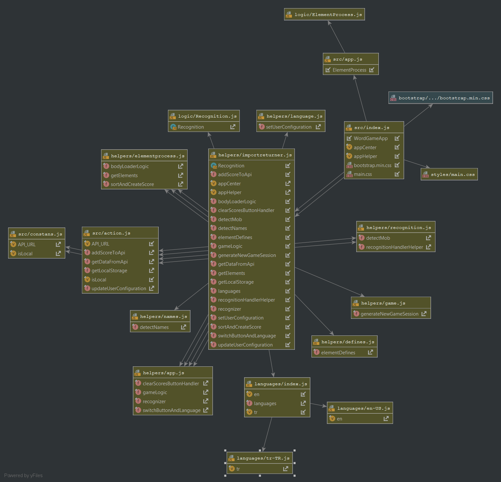

# word-game
#### Demo : https://hakkisabah.github.io/word-game/dist/index.html 

## Explanation

The word game uses the user's microphone through the user's browser, the game is played by deriving a new name from the last letter of the word displayed on the screen.

The rules that apply to each game are:
- Name repetition cannot be made within the same ongoing game.
- Each new name found must begin with the last letter of the previous name.
- These operations should be done within 8 seconds.

Requirements for play:
- Working microphone
- Latest version Chrome Browser
- A quiet environment

### Development
Configured all required development environment.

You should be typing to your terminal `npm install` while in word-game folder after the cloning this repository for developing and understanding

### Diagram
Information about how the code distribution takes place can be obtained from the diagram.

As seen in this diagram, the helpers can communicate with each other only through the application trigger(index.js).

